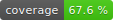

# `lcov_badge_generator`


A badge generator for coverage report generated by [`lcov`](http://ltp.sourceforge.net/coverage/lcov.php).

## Example



## Usage

```
Parse html output from gcov/lcov/genhtml to generate a coverage badge.

USAGE:
    lcov_badge_generator [FLAGS] [OPTIONS] <html_file>

FLAGS:
    -h, --help       Prints help information
    -p, --print      Only print coverage percentage to stdout
    -V, --version    Prints version information

OPTIONS:
    -o, --output <OUTPUT_FILE>    The output file [default: badge.svg]

ARGS:
    <html_file>    The generated index.html
```
